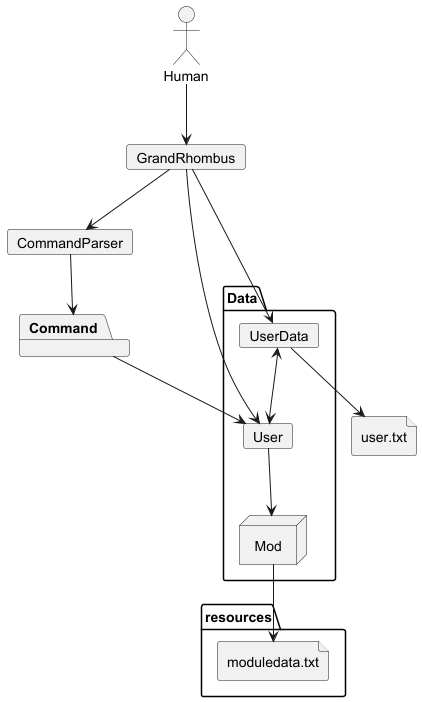
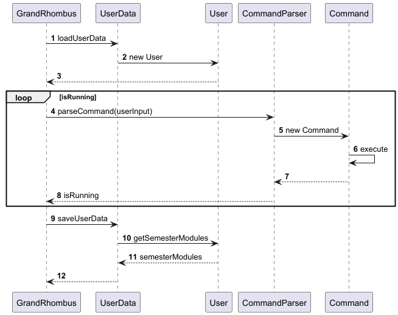
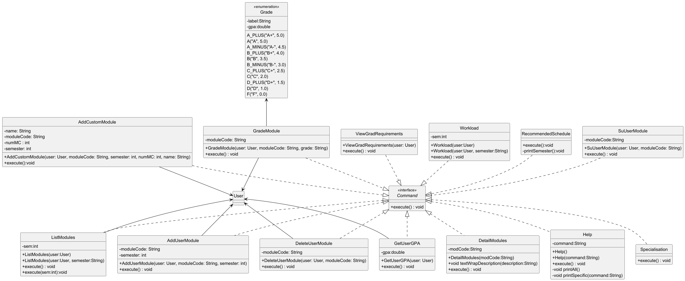

<h1 style="color:#5DADE2; text-decoration:underline;">
  <a href="https://github.com/AY2425S2-CS2113-T11b-2/tp" style="color:#5DADE2; text-decoration:underline;">
    Grand Rhombus Developer Guide
  </a>
</h1>

---

Grand Rhombus aims to provide <span style="color:blue;">CEG Students</span> with an <span style="color:green;">Academic Life Planner</span> which is <span style="color:red;">_in-depth_</span> and <span style="color:red;">_clear_</span> to plan their future.

This planner <span style="color:red;">reduces confusion</span> from having to cross-reference multiple sources so that students <span style="color:red;">do not miss academic opportunities</span>.

---

- **Acknowledgements**
- **Setting up, getting started**
- **Design**
  - Architecture
  - UI component
  - Logic component
  - Model component
  - Storage component
  - Common classes
- **Implementation**
  - [Proposed] Undo/redo feature
    - Proposed Implementation
    - Design considerations:
  - [Proposed] Data archiving
- **Documentation, logging, testing, configuration, dev-ops**
- **Appendix: Requirements**
  - Product scope
  - User stories
  - Use cases
  - Non-Functional Requirements
  - Glossary
- **Appendix: Instructions for manual testing**
  - Launch and shutdown
  - Deleting a person
  - Saving data

---

<h2>
<span style="color:orange;">Acknowledgements</span>
</h2>

- This project was inspired by the popular NUSMods website, aiding NUS students with their course and study plannings.

This project would not have been possible without the contributions and resources provided by various individuals and organizations. We would like to express our sincere gratitude to:

- **NUSMods Developers & Contributors**
    - For maintaining the NUSMods API and open-source data, which this module planner relies on for retrieving module information.

- **National University of Singapore (NUS)**
    - For providing the curriculum structure and academic resources that guided the development of this planner.

- **Open-Source Libraries & Frameworks**
    - This project referenced and used the following:
        - [JUnit](https://junit.org/) for testing
        - [Duke project](https://github.com/nus-cs2103-AY2324S1/ip), which provided a foundational understanding of Java-based CLI applications and software engineering principles.
        - [Gradle](https://gradle.org/) for build automation and dependency management

- **Professors, Mentors, and Peers**
    - Special thanks to Professor Akshay, TA Aditi & TA Donovan, and our peers for their valuable guidance, feedback, and support throughout this project.

- **Online Resources & Developer Communities**
    - We also appreciate the vast knowledge shared by developers on platforms like Stack Overflow, GitHub, and various Java documentation sources that helped us troubleshoot and enhance our implementation.


---

<h2>
<span style="color:orange;">Setting up & Getting Started</span>
</h2>

<div style="background-color: #fff3cd; border-left: 6px solid #ffa502; padding: 10px;">
<strong>⚠️  Caution: Follow the steps in the following guide precisely. </strong>
The code may not work as intended if steps are deviated from
</div>

<br/>

First, **fork** this repo, and **clone** the fork into your computer.

##### If you plan to use Intellij IDEA (highly recommended):

**Configure the JDK:** Follow the guide [se-edu/guides] IDEA: Configuring the JDK to ensure Intellij is configured to use JDK 17.

**Import the project as a Gradle project:** For instructions on importing a Gradle project into IntelliJ IDEA, refer to the [se-edu guide](https://se-education.org/guides/tutorials/intellijImportGradleProject.html).


<div style="background-color: #89CFF0; border-left: 6px solid #ffa502; padding: 10px;">
<strong> Note: </strong> Importing a Gradle project is slightly different from importing a normal Java project.
</div>
<br/>

**Verify the setup:**
- Run the seedu.address.Main and try a few commands.
- Run the tests to ensure they all pass.
- Refer to the **Manual Testing** section for more in-depth instructions on testing


---

<h2>
<span style="color:orange;">Design</span>
</h2>

<h4>
<span style="color:orange;">Architechture</span>
</h4>




The **_Architecture Diagram_** given above explains the high-level design of
the App.

Given below is a quick overview of main components and how they interact with
each other.

**Main components of the architecture**

**`GrandRhombus`** is in charge of the app launch and shut down.

- At app launch, it initializes the other components in the correct sequence, and connects them up with each other.
- At shut down, it shuts down the other components and invokes cleanup methods where necessary.

The bulk of the app’s work is done by the following three components:

- **`CommandParser`**: Parses user input and chooses the command
- **`Command`**: The individual commands which are then executed. 
- **`Data`**: A collection of classes including `User`, `UserData` which loads and saves user's modules (`Mod`) into **`user.txt`** file

*`Resources`* contains the `moduledata.txt` file which serves as the database of all CEG modules. 
These modules are converted into `Mod`s to be stored in other components.

**How the architecture components interact with each other**

The _Sequence Diagram_ below shows how the components interact with each other from startup to termination.

Note: Command.execute() may use User depending on which command it is e.g. `/add` adds a module to the User's semesterModules list

The program runs continuously till the user inputs `/exit`, which causes `CommandParser` to return **false** to isRunning.

The sections below give more details of each component.

---

<h4>
<span style="color:orange; text-decoration:underline;">CommandParser component</span>
</h4>

The `CommandParser` component consists of the `CommandParser` class. 

The `CommandParser` component,

- processes user input and chooses corresponding command.
- creates new command parses arguments into the command.
- executes user commands using the `Command` component.
- returns `isRunning` which is true for all user inputs except `/exit`

---

<h4>
<span style="color:orange; text-decoration:underline;">Command component</span>
</h4>

Here’s a (partial) class diagram of the `Command` component:


To add: Sequence Diagram for /add command 

How the `Command` component works:

1. The parameters of `Command` are passed into the chosen command object and the object is created
2. `Command` is then executed to perform its corresponding function

---

<h4>
<span style="color:orange; text-decoration:underline;">Data component</span>
</h4>

The `Data` component,

- Loads user data and module data when program starts.
- Saves user data when program is terminated.
- ModData deals with module data from the database. UserData deals with storage of User
data such as user details and modules. 
- depends on some classes in the `Model` component (because the `Storage` component’s job is to save/retrieve objects that belong to the `Model`)

### `User` class

The `User` class represents a user in the system. It contains information about the user's name, education level, GPA, current semester, and the modules they are taking each semester.

#### Attributes:
- `name`: The name of the user.
- `education`: The education level of the user.
- `gpa`: The current GPA of the user.
- `currentSemester`: The current semester the user is in.
- `semesterModules`: A map where the key is the semester number and the value is a list of `UserMod` objects representing the modules taken in that semester.

#### Methods:
- `getGPA()`: Returns the current GPA of the user.
- `getTotalMCs()`: Returns the total number of modular credits (MCs) the user has taken.
- `updateGPA()`: Updates the user's GPA based on their module grades.
- `hasModule(String code)`: Checks if the user has a module with the given code.
- `clearModules()`: Clears all modules from the user's record and resets the GPA.
- `getModule(String code)`: Retrieves a module by its code.
- `checkAllPrereqs()`: Checks if the user fulfills all prerequisites for their modules.
- `fulfillsModPrereq(UserMod mod, int semester)`: Checks if the user fulfills the prerequisites for a specific module.
- `getCurrentSemester()`: Returns the current semester of the user.
- `setCurrentSemester(int currentSemester)`: Sets the current semester of the user.
- `getName()`: Returns the name of the user.
- `setName(String name)`: Sets the name of the user.
- `getEducation()`: Returns the education level of the user.
- `setEducation(EducationLevel education)`: Sets the education level of the user.
- `getAllModules()`: Returns a list of all modules the user has taken.
- `getAllModulesTilSemester(int semester)`: Returns a list of all modules the user has taken up to a specific semester.

### `UserMod` class

The `UserMod` class represents a module that a user is taking. It contains information about the module's code, name, number of modular credits (MCs), grade, and whether the module is S/U (Satisfactory/Unsatisfactory) optioned.

#### Attributes:
- `code`: The code of the module.
- `name`: The name of the module.
- `numMC`: The number of modular credits (MCs) for the module.
- `grade`: The grade received for the module.
- `isSU`: A boolean indicating if the module is S/U optioned.

#### Methods:
- `getCode()`: Returns the code of the module.
- `getName()`: Returns the name of the module.
- `getNumMC()`: Returns the number of modular credits (MCs) for the module.
- `getGrade()`: Returns the grade received for the module.
- `isSU()`: Returns whether the module is S/U optioned.

### `Mod` class

The `Mod` class represents a module in the system. It contains information about the module's code, name, number of modular credits (MCs), and prerequisites.

#### Attributes:
- `code`: The code of the module.
- `name`: The name of the module.
- `numMC`: The number of modular credits (MCs) for the module.
- `prereqTree`: The prerequisite tree for the module.

#### Methods:
- `getCode()`: Returns the code of the module.
- `getName()`: Returns the name of the module.
- `getNumMC()`: Returns the number of modular credits (MCs) for the module.
- `getPrereqTree()`: Returns the prerequisite tree for the module.
- `getPrerequisites()`: Returns the list of prerequisite modules for the module.


---

<h2>
<span style="color:orange;">Implementation</span>
</h2>

This section describes some noteworthy details on how certain features are
implemented.

<h4>
<span style="color:orange; text-decoration:underline;">Add/Delete Module feature</span>
</h4>

<h4>
<span style="color:orange;">Add Custom Module</span>
</h4>

The add custom module feature is implemented in the `AddCustomModule1` class that implements the
`Command` class. This feature allows the user to add modules that are not within the existing
database into their schedule. 

The `execute()` method of this class creates a new `UserMod` object that contains the module code, 
module name and number of MCs inputted by the user. It then adds the new module into a semester specified by the user. 

<h4>
<span style="color:orange; text-decoration:underline;">Module Data feature</span>
</h4>

<h4>
<span style="color:orange;">Check for prerequisites</span>

<span style="color:orange; text-decoration:underline;">Add User Module</span>
</h4>

This class takes in the Module Code and Semester. It then retrieves the dictionary of User's modules (`semesterModules`) 
from the `User` class, adds the new `Mod` to the corresponding semester list, creating new semester lists if it does 
not exist. Then it sets the new list of modules in the `User` class `semesterModules`

<h4>
<span style="color:orange; text-decoration:underline;">Specialisation</span>

</h4>
This class simply prints out all the Specialisations. 

This check for prerequisite mechanism is implemented by `Prereq`. It contains a `fulfillsPrereq()` function
that returns true if all the modules in the user's schedule have had their prerequisite modules cleared.
This class includes the following subclasses: 

- `ModPrereq` -- Contains a constructor to instantiate a `Prereq` object containing the module code 
and the minimum grade required.
- `AndPrereq` -- Contains functions to check for 'AND' prerequisites (i.e. prerequisites that must all be
completed before taking a module).
- `OrPrereq` -- Contains functions to check for 'OR' prerequisites (i.e. prerequisites where only one needs
to be completed before taking module).

`AndPrereq` and `OrPrereq` overrides the `fulfillsPrereq()` function.


_{more aspects and alternatives to be added}_

<span style="color:orange; text-decoration:underline;">Retrieve User GPA</span>
</h4>


The GPA feature is implemented in the `GetUserGPA` class, which implements the `Command` interface.
The `execute()` method of this class retrieves the user's GPA from the `User` object and displays it
to the user. This mechanism is facilitated by the `User` class, which contains the `updateGPA()` method
to calculate the GPA based on the user's module grades.

<h4>
<span style="color:orange; text-decoration:underline;">Help Command</span>
</h4>

The help command is implemented in the `HelpCommand` class, which implements the `Command` interface.
The `execute()` method of this class displays a list of available commands and their descriptions to the user.
This mechanism is facilitated by the `CommandParser` class, which maps user input to the corresponding command.


---

<h2>
<span style="color:orange; text-decoration:bold;">Documentation, logging, testing, configuration, dev-ops</span>
</h2>

- [Documentation guide](/addressbook-level3/Documentation.html)
- [Testing guide](/addressbook-level3/Testing.html)
- [Logging guide](/addressbook-level3/Logging.html)
- [Configuration guide](/addressbook-level3/Configuration.html)
- [DevOps guide](/addressbook-level3/DevOps.html)

---

<h2>
<span style="color:orange; text-decoration:bold;">Appendix: Requirements</span>
</h2>

<h4>
<span style="color:orange; text-decoration:underline;">Product scope</span>
</h4>

**Target user profile** :

- NUS CEG Students
- has a need to manage their academic workload
- prefer desktop apps over other types
- can type fast
- prefers typing to mouse interactions
- is reasonably comfortable using CLI apps

**Value proposition** : We provide CEG Students with an Academic Life Planner which is in-depth and clear to plan their future. This planner reduces confusion from having to cross-reference multiple sources so that students do not miss academic opportunities.

<h4>
<span style="color:orange; text-decoration:underline;">User Stories</span>
</h4>

Priorities: High (must have) - `* * *`, Medium (nice to have) - `* *`, Low
(unlikely to have) - `*`

| Priority | As a …​                                                | I want to …​                                                                                | So that I can…​                                            |
|----------|--------------------------------------------------------|---------------------------------------------------------------------------------------------|------------------------------------------------------------|
| `* * *`  | disciplined student                                    | be able to see my GPA, as well as an estimated future GPA based on my current module grades | make informed decisions about my future workload.          |
| `* * *`  | international student, entering NUS as a CEG1 student. | be able to see the platforms that I need to register on and their deadlines                 | register on time.                                          |
| `* * *`  | student who wants to plan my academic journey          | view my graduation requirements and track my progress                                       | ensure I graduate on time.                                 |
| `* *`    | student who is considering taking a minor              | see how the minor requirements fit into my current schedule                                 | decide if I can take the minor without overloading myself. |
| `* *`    | student who is planning to go on an exchange program   | know which modules I can map to my degree requirements                                      | plan my exchange program effectively.                      |
| `*`      | student who is curious about other specializations     | explore the requirements for other specializations                                          | consider switching if needed.                              |
| `*`      | student who wants to improve my productivity           | receive tips on how to manage my time effectively                                           | balance my academic and personal life.                     |

<h4>
<span style="color:orange; text-decoration:underline;">Use cases</span>
</h4>

(For all use cases below, the **System** is `GrandRhombus` and the
**Actor** is the `user`, unless specified otherwise)

**Use case: Add a Module**

**MSS**

1. User requests to list modules
2. GrandRhombus shows a list of modules in their schedule
3. User requests to add a specific module in the list
4. GrandRhombus adds the module

Use case ends.

**Extensions**

- 2a. The list is empty.

Use case ends.

- 3a. The given module code is invalid.

  - 3a1. GrandRhombus shows an error message.

Use case resumes at step 2.

_{More to be added}_

<h4>
<span style="color:orange; text-decoration:underline;">Non-Functional Requirements</span>
</h4>

1. Should work on any _mainstream OS_ as long as it has Java `17` or above installed.
2. Should be able to hold up to 180 MCs worth of modules in the list without a noticeable sluggishness in performance for typical usage.
3. A user with above average typing speed for regular English text (i.e. not code, not system admin commands) should be able to accomplish most of the tasks faster using commands than using the mouse.

_{More to be added}_

<h4>
<span style="color:orange; text-decoration:underline;">Glossary</span>
</h4>

- **Mainstream OS** : Windows, Linux, Unix, MacOS
- **MC** : Modular Credits
- **GPA** : Grade Point Average
- **S/U** : Satisfactory/Unsatisfactory
- **CEG** : Computer Engineering
- **NUS** : National University of Singapore
- **NUSMods** : A web application that provides information about modules and their prerequisites at NUS.

---

<h2>
<span style="color:orange; text-decoration:bold;">Appendix: Instructions for manual testing</span>
</h2>

Given below are instructions to test the app manually.

**Note:** These instructions only provide a starting point for testers to work
on; testers are expected to do more _exploratory_ testing.

<h3>
<span style="color:orange; text-decoration:underline;">Launch and shutdown</span>
</h3>

#### Initial Launch
1. Download the JAR file and copy it into an empty folder.
2. Open a terminal or command prompt, navigate to the folder, and run:
   ```sh
   java -jar GrandRhombus.jar
   ```
   The GUI launches successfully with an initial state.

#### Saving Window Preferences
1. Resize the window to an optimum size.
2. Move the window to a different location.
3. Close the window.
4. Re-launch the app by double-clicking the JAR file.
   - Expected: The most recent window size and location is retained.

<h3>
<span style="color:orange; text-decoration:underline;">Command testing</span>
</h3>

#### Exiting the Application
- Type `/exit` in the command line and press Enter.
    - The application shuts down successfully.

#### Viewing Modules
- Test case: `/view`
    - Displays the list of modules.

#### Viewing Module Details
- Test case: `/detail CS2113`
    - Displays details of the module CS2113.

#### Adding a Module
- Test case: `/add CS2113 4`
    - Adds module CS2113 successfully to semester 4.
- Test case: `/add`
    - "Error: Please specify a module code to add. Usage: /add MODULE_CODE SEMESTER"

#### Deleting a Module
- Test case: `/delete CS2113`
    - Deletes module CS2113 successfully.
- Test case: `/delete`
    - "Error: Please specify a module code to delete."

#### Invalid Commands
- Test case: `/randomcommand`
    - "Unknown command. Type '/help' for a list of commands."

#### Checking Workload
- Test case: `/workload`
    - Displays the workload if modules are present.
    - Edge Case: If no modules are present, displays "No modules in List".

#### Checking Graduation Status
- Test case: `/grad`
    - Displays graduation progress.

<h3>
<span style="color:orange; text-decoration:underline;">Data persistence testing</span>
</h3>

These tests help verify the core functionality of the command parser and the application's robustness
against invalid inputs.


#### Handling Empty Module List
- Test case: Ensure no modules are added, then execute `/view`.
    - Displays empty semester lists.


#### Saving data
User and module data will be automatically saved upon call of `/exit` at  `[JAR file location]/data/mod_data.txt` & `[JAR file location]/data/user.txt` respectively.


